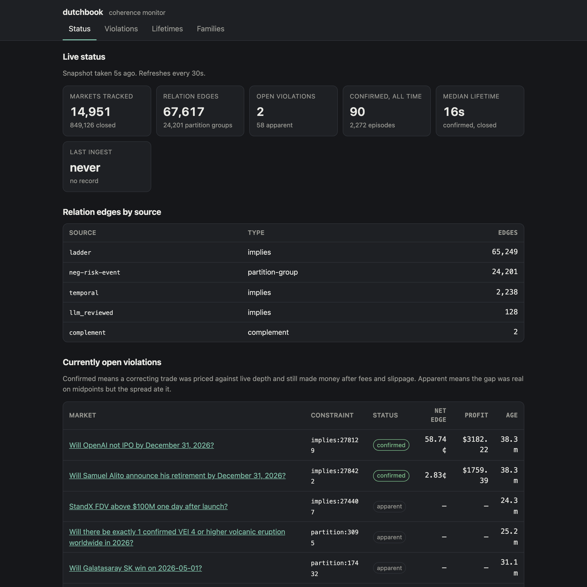
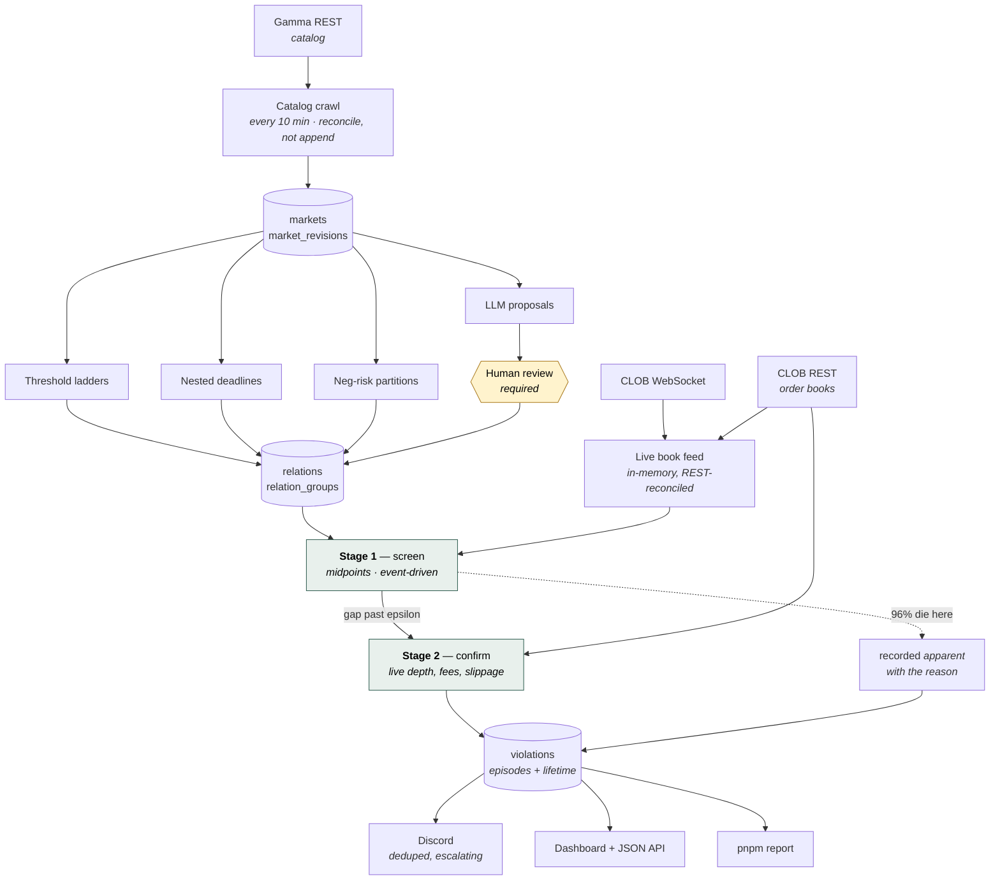

# dutchbook

[](https://github.com/stephenqiao1/dutchbook/actions/workflows/ci.yml)

**Watches every market on Polymarket for combinations of prices that cannot all be true at once, and measures how long the contradiction survives.**

> **A logical contradiction on Polymarket has a median lifetime of 15 seconds.**
> Across 2,248 closed episodes, half of every inconsistency found was gone before
> you could finish reading about it. Only 3.9% were executable once the spread,
> fees and real order-book depth were priced — and [the two that looked most
> profitable turned out to be bugs in my own relation extractor](docs/BLOG.md).

**Live dashboard → <https://dutchbook.fly.dev/>** · [full report](docs/REPORT.md) · [the write-up](docs/BLOG.md) · [`/health`](https://dutchbook.fly.dev/health) · [`/metrics`](https://dutchbook.fly.dev/metrics)

[](https://dutchbook.fly.dev/)

TypeScript, Fastify, Postgres via Drizzle, BullMQ on Redis, deployed on Fly.io.

---

## What is a dutch book?

A prediction market sells contracts that pay $1 if something happens and $0 if it
doesn't. The price is therefore a probability: a contract trading at 62¢ is the
market saying "62% likely".

Probabilities have to obey arithmetic, and that gives you facts about prices that
need no opinion about the world:

- **Implication.** "Bitcoin above $150k" cannot happen without "Bitcoin above
  $120k" also happening. So P(above 150k) ≤ P(above 120k), always. If the first
  trades at 40¢ and the second at 35¢, the prices are impossible.
- **Complement.** "Yes" and "No" on the same question must sum to $1.
- **Partition.** If exactly one of eight candidates must win, their eight prices
  must sum to $1. If they sum to $1.15, something is wrong.

A **dutch book** is a set of bets you can place against prices like these that
wins money *whatever happens*. In the implication example: buy the cheap contract
that must pay out whenever the dear one does, sell the dear one, and every
possible future leaves you ahead. You need no view on Bitcoin. The inconsistency
itself is the edge — which is why it is named after the bookmaker who lets you do
it, not the gambler who does.

The name is the whole thesis: **if a market is coherent, no dutch book exists.**
This service looks for the ones that do.

### Why fifteen seconds is the interesting number

It is far too fast for a person. Nobody opens a market page, notices that eight
probabilities sum to $1.07, and places eight orders inside fifteen seconds.

So the number says something about *who* is enforcing coherence, and the honest
answer is that it may be nobody. Either automated traders close these gaps faster
than a human can act, or the gaps were never real — quotes on separate markets
drift independently, and two of them crossing a threshold and crossing back is
not an opportunity that anyone corrected. **This measurement cannot tell those
apart**, and [the report says so](docs/REPORT.md) rather than picking the
flattering interpretation.

What it does settle is the shape of the opportunity. If you were hoping to trade
these by hand, fifteen seconds is your answer.

---

## Architecture



The shape to notice: **nothing reaches the checker without passing through
Postgres, and no LLM output reaches the graph without a human verdict.**

---

## Design decisions

**Ingest is a reconciliation, not an append.** Each crawl computes a content hash
per market and compares it against the stored one. Unchanged markets get their
`last_seen_at` touched and nothing else; changed markets get a row per altered
field in `market_revisions`, recording old and new values. Markets that stop
appearing are marked `missing_since` rather than deleted, because a vendor
omitting a record is not the same as a market ceasing to exist, and the
difference matters when you later ask what changed. The payoff is that the change
log is *evidence*: if Polymarket silently edits a resolution rule after a market
opens, the diff is in the database. An append-only design would record the same
fact as "here are 300,000 rows again", which proves nothing.

**Idempotency is a property, not a hope — see
[`test/catalog-ingest-is-idempotent.test.ts`](test/catalog-ingest-is-idempotent.test.ts).**
Running the same crawl twice must change nothing: no new rows, no revisions, no
moved content hashes. The test runs against real Postgres, because the properties
under test are database properties — upsert semantics, jsonb round-tripping, and
the unique constraint that deduplicates archived payloads — and an in-memory fake
cannot fail the way a database fails. The two runs use *different* clocks, so the
only column permitted to differ has genuinely moved; freezing the clock would
make the assertion vacuous. This is the load-bearing test in the repo: if it
fails, the change log is noise and the schema's entire purpose is gone.

**LLM-proposed edges require a human verdict, because a wrong edge is worse than
a missing one.** The model proposes pairs the deterministic extractors miss;
every proposal lands in `relation_proposals` with a status, and *nothing enters
the graph without a recorded human decision*. The asymmetry justifies the
friction: a missing edge costs an opportunity nobody notices, while a reversed
edge produces a confident, well-formed, fully-priced trade that is a guaranteed
loss. That is not hypothetical — it has happened twice here, and both times the
arithmetic downstream was flawless and the premise was backwards. 223 of 225
proposals were accepted, which says more about the filter than the model:
candidates had already survived embedding similarity and a transitive-closure
anti-join, so the base rate going in was nowhere near 50%.

**Stage 1 and stage 2 exist because a midpoint is not a price.** Screening every
constraint against cached midpoints is nearly free and nearly always says
"satisfied"; confirming one costs an order book per token. Running the expensive
check over the whole graph would spend the entire rate-limit budget rediscovering
that almost everything is priced consistently. So stage 1 screens on midpoints,
and only gaps past a configurable epsilon reach stage 2, which fetches live books,
constructs the concrete correcting basket, walks it level by level, and charges
fees and slippage. The two stages disagree constantly and **that disagreement is
the product**: 96% of screened violations die in stage 2, and recording them as
`apparent` *with the reason* is what separates this from a scanner that calls
every midpoint gap free money.

**Rate limiting assumes the budget is global, because it is.** Polymarket enforces
per-IP limits at the edge, so every client in the process shares one allowance.
Two independent token buckets would each believe itself well under budget while
together exceeding it, and the symptom would be someone else's crawl getting
throttled. So the bucket, the `Retry-After` parsing and the backoff live in one
module ([`src/polymarket/http.ts`](src/polymarket/http.ts)) that both the Gamma
and CLOB clients import — "the CLOB client rate-limits like the Gamma client" is
guaranteed by *being the same code* rather than by two copies that agree today.
Backoff uses full jitter rather than equal jitter for the same reason:
correlated retries against a shared budget are how a blip becomes an outage.

---

## Things that broke in production

The most useful section in this file.

### A $435 risk-free arbitrage that was a guaranteed loss

**What happened.** The checker confirmed a dutch book on Trump approval-rating
markets — a full trade construction, priced against live depth, clearing fees and
slippage. It was a bet that pays **zero** in one of three states.

**What the alert said.** Nothing. No alert fired, because nothing was broken:
every component did its job correctly on a false premise. It was caught only
because "verify one trade by hand against the Polymarket site" was an acceptance
criterion.

**The fix.** The ladder extractor read `hit 35%` as an upward threshold.
Polymarket's own resolution criteria for that family say *"resolve to Yes if the
approval rating is **equal to or below** the listed value"* — so falling to 30%
entails having passed 35%, the exact reverse of what was recorded. **888 live
markets** paired a `hit`/`reach` question with a below-style rule, and both
directions exist inside the same-looking family (2025 markets resolve "at or
above", 2026 ones "at or below"), so no amount of reading question text would
have settled it. `hit` and `reach` are now flagged ambiguous, resolved against the
resolution criteria, and **refused outright when the criteria do not say**.

### …then the same class of bug in a different extractor

**What happened.** The dashboard showed two confirmed violations at 58.74¢ and
2.83¢ net edge. A 30¢ risk-free return is not something a real venue leaves lying
around.

**What the alert said.** Discord fired correctly — *"confirmed violation, net edge
58.90¢, max size 5,594"* — and it was right to. The alert layer had no way to know
the premise was wrong.

**The fix.** Outstanding, and [documented in the report](docs/REPORT.md) with the
executable count marked as zero. Computing a denominator I had not looked at
before showed all 90 confirmed episodes were **2 constraints** re-detected 45
times each, and the extractor's own stored rationale gives both away: `"OpenAI
**not** IPO by 2026"` recorded as entailing `"not IPO by 2027"` (true for a
positive event, backwards for a negated one), and `"retirement by Dec 31"`
entailing `"by Sept 30"` (wrong on its face). The `temporal` extractor needs the
audit the ladder extractor already had.

### The ingest has not succeeded since Polymarket changed a response shape

**What happened.** Production stopped ingesting; the catalog is frozen at 6,599
active markets.

**What the alert said.** `unexpected event page shape: expected a 'data' array` —
a zod parse failure, surfaced through the dead-letter queue and visible as
`LAST INGEST: never` on the dashboard.

**The fix.** Outstanding. This is precisely the failure the
`gamma-parse-failures` alert exists for: a *rate* of parse failures is the early
warning that a vendor changed their schema, which is the failure mode where
everything downstream keeps running and silently means something else.

### `permission denied to create extension "vector"`

**What happened.** Every deploy failed at the release command.

**What the alert said.** The deploy aborted with the message above and left the
previous version serving — which is what should happen when a migration fails.

**The fix.** Fly Managed Postgres marks pgvector `trusted: false, superuser:
true`, so only the provider can install it:
`fly mpg databases extensions enable vector --cluster <id> --database <db>`. My
first conclusion was that only Fly support could do this — wrong about the
conclusion, right about the mechanism.

### The dashboard took 25 seconds, and the cache made it worse

**What happened.** `/api/status` on production took between 6 and 25 seconds, and
got *slower* on repeat requests.

**What the alert said.** Nothing — found by timing the endpoint after deploying
it. Worth recording as a gap: there is no latency alert.

**The fix.** The status aggregate scans ~300k markets with no index on `closed`.
It had a 10-second TTL cache, and **when the query is slower than the TTL, every
request is a miss**: the cache was pure overhead and every visitor waited on
Postgres. Replaced with stale-while-revalidate — serve the stale value
immediately, refresh behind it — plus priming at boot so the first visitor does
not pay. Measured after: 6.7s cold, **90ms warm**.

### Every confirmed trade reported $0.00 profit

**What happened.** The checker confirmed violations and priced each one at exactly
zero profit.

**What the alert said.** Nothing fired, because a $0.00 edge is below the alert
threshold. The bug hid by *suppressing its own alert*.

**The fix.** The trade was being priced at `maxExecutableSize` — the size at which
edge reaches zero, which is break-even by definition. Added a ternary search for
the profit-maximising size (profit is concave because cost is convex), keeping max
executable size as a separate reported field.

### Postgres died on a query that reads like a full disk

**What happened.** The service refused to start: `could not resize shared memory
segment "/PostgreSQL.2597382736" to 8388608 bytes: No space left on device`. There
were 400 GB free.

**What the alert said.** A fatal startup error, so the process exited rather than
serving with a half-built constraint set.

**The fix.** Docker defaults `/dev/shm` to 64 MB, which Postgres uses for parallel
query workers, and the partition-group aggregate joins 24k groups against 860k
markets. `shm_size: '1gb'` in `docker-compose.yml`.

---

## Quickstart

Needs Node 22+, pnpm, and Docker.

```bash
git clone https://github.com/stephenqiao1/dutchbook && cd dutchbook
pnpm install
cp .env.example .env          # defaults already match docker-compose.yml

docker compose up -d          # Postgres 16 + pgvector, Redis 7
pnpm db:migrate

pnpm dev                      # http://localhost:3000
```

`GET /health` returns `{"status":"ok",...}` once Postgres and Redis answer. The
dashboard is at `/`.

```bash
pnpm test                     # 769 tests; DB-backed ones use testcontainers
pnpm typecheck && pnpm lint

pnpm job:ingest               # one catalog crawl, on demand
pnpm relations:extract        # rebuild the constraint graph
pnpm coherence:report         # lifetime stats in the terminal
pnpm report                   # docs/REPORT.md + charts
pnpm load-test                # behaviour at 10x catalog size
```

Every environment variable is documented in [`.env.example`](.env.example) and
validated by zod at startup — the process refuses to boot on a bad one rather
than failing later.

## At 10× the catalog it runs out of memory

[`docs/LOAD.md`](docs/LOAD.md), regenerated by `pnpm load-test`, against a
synthetic 10× graph: 150,000 markets, 676,000 edges, 918,000 constraints.

| | 1× (today) | 10× |
| --- | ---: | ---: |
| `loadConstraints` | 0.65s / 79 MB | 3.8s / 803 MB |
| `screen` | 0.06s / 52 MB | 0.7s / 440 MB |
| Dashboard status aggregate | 0.04s | 0.65s |
| **Peak RSS** | **156 MB** | **1,124 MB** |

Production runs on a 512 MB machine. **At 10× it does not get slow, it gets
OOM-killed**: stage 1 materialises every constraint as a JavaScript object on
every run, so the footprint tracks the graph rather than the workload. The fix is
to stream constraints in batches and screen each batch as it arrives — nothing
about the two-stage design requires the whole graph to be resident at once.

## Where to look next

| | |
| --- | --- |
| [docs/DESIGN.md](docs/DESIGN.md) | Every subsystem in depth, and the vendor hazards behind each |
| [docs/REPORT.md](docs/REPORT.md) | The generated analysis, including its own limitations section |
| [docs/BLOG.md](docs/BLOG.md) | The write-up, leading with the lifetime finding |
| [docs/LOAD.md](docs/LOAD.md) | Load test at 10× |
| [CONTRIBUTING.md](CONTRIBUTING.md) | How to work on this |

## Licence

[MIT](LICENSE). Nothing here is trading advice; read the limitations section of
the report before believing any number in it.
