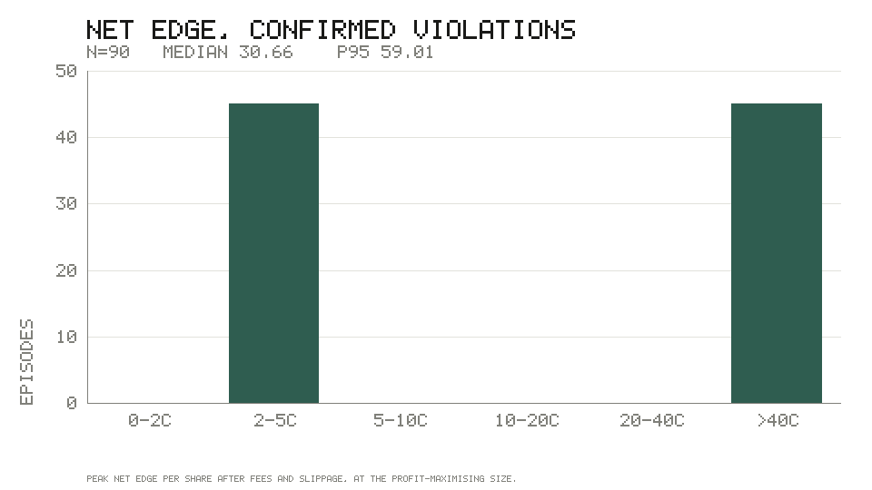
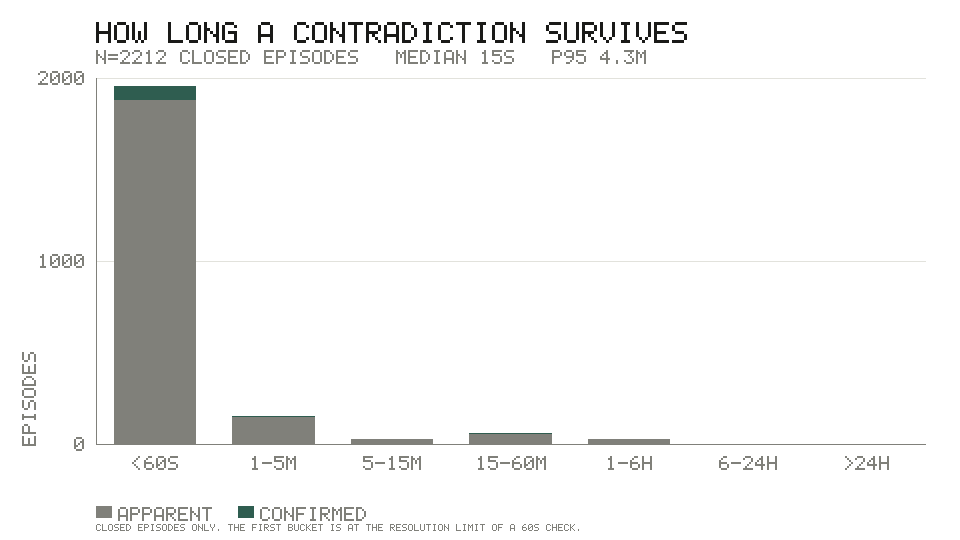
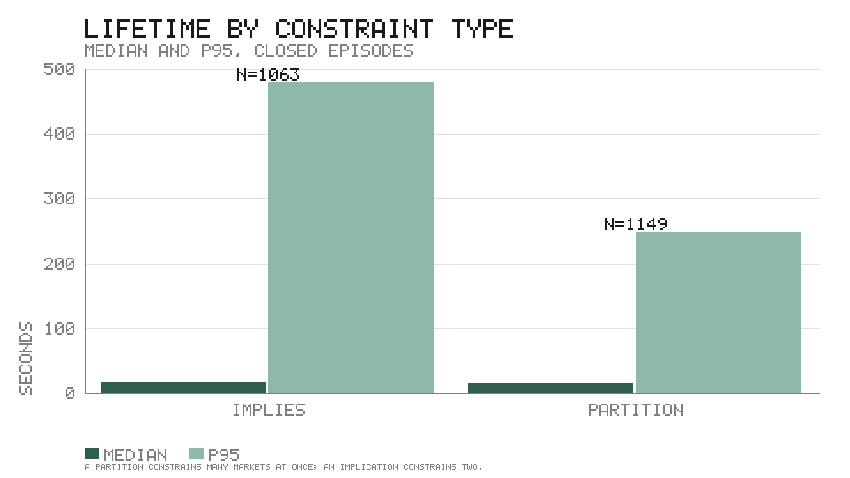
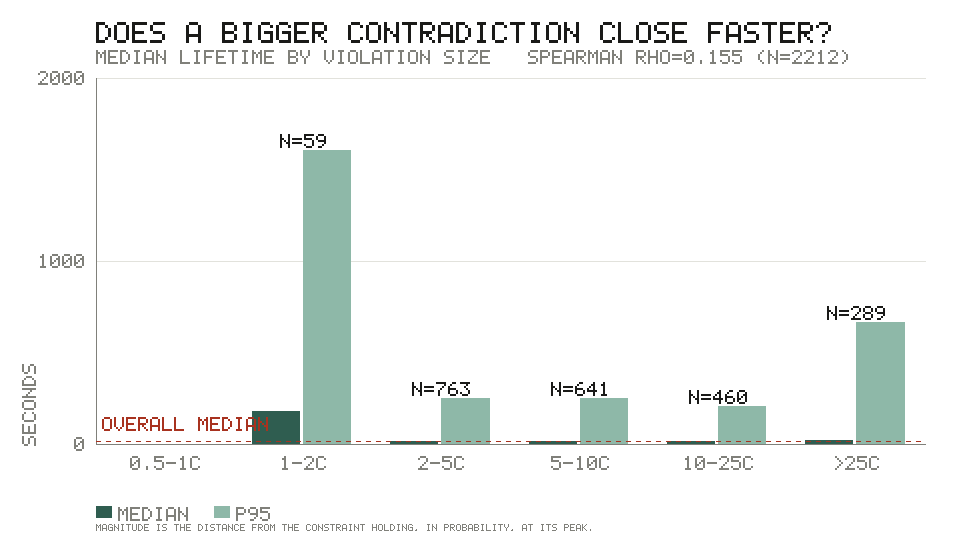
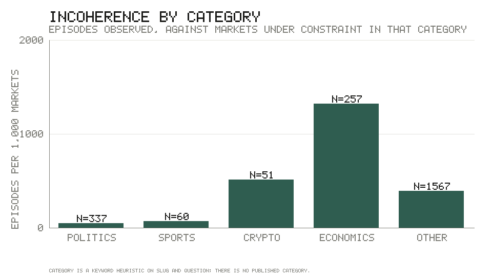
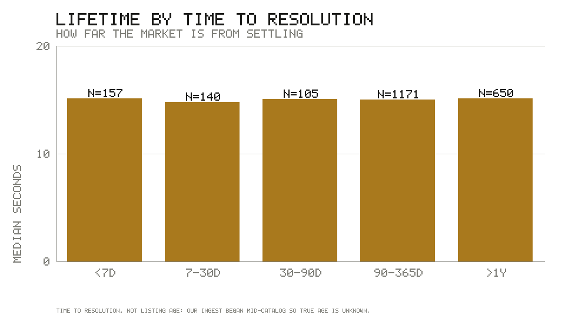
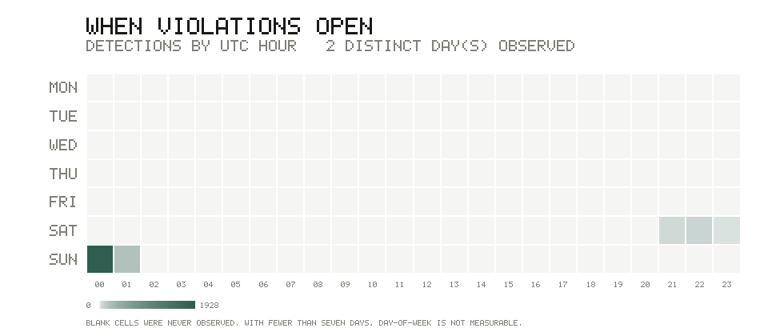

# dutchbook: coherence in the Polymarket catalog

Generated 2026-08-02T02:02:14.543Z by `pnpm report`. Every figure below is computed
from the database at run time; none is written by hand. The report reads whatever
`DATABASE_URL` points at, so which database produced a given copy is a property of how
it was run and not of this file — the observation window below is the way to tell.

## Observation window

|  |  |
| --- | --- |
| First detection | 2026-08-01T21:50:58.700Z |
| Last observation | 2026-08-02T01:55:09.157Z |
| Elapsed | 4.1 hours (0.17 days) |
| Episodes recorded | 2,272 |
| Distinct calendar days | 2 |

> **This is not thirty days of data.** The checker has been running for
> 4.1 hours, across
> 2 calendar day(s). Every rate, every time-of-day pattern and every
> day-of-week claim below is therefore either unavailable or drawn from a window too
> short to support it, and is labelled as such where it appears. The distributional
> findings — lifetime, net edge, the size/lifetime relationship — have enough
> episodes (n=2,212 closed) to be worth reading, with the caveat that they
> describe a few hours of one particular market session and not a month.

## 1. Catalog and coverage

| Metric | Value |
| --- | --- |
| Markets in catalog | 864,077 |
| Active (open, not missing) | 14,951 |
| Closed | 849,126 |
| Markets in at least one relation or group | 264,128 |
| …of which active | 12,774 |
| Coverage of the active catalog | 85.4% |

### Edges by source

| Source | Type | Edges |
| --- | --- | --- |
| `ladder` | implies | 65,249 |
| `temporal` | implies | 2,238 |
| `llm_reviewed` | implies | 128 |
| `complement` | complement | 2 |

| Group source | Partition groups |
| --- | --- |
| `neg-risk-event` | 24,201 |

### LLM-assisted proposals

| Metric | Value |
| --- | --- |
| Proposals generated | 225 |
| Reviewed | 225 |
| Accepted | 223 |
| Rejected | 2 |
| Acceptance rate | 99.1% |
| Edges actually in the graph from this source | 128 |

Accepted proposals (223) exceed the edges that landed
(128): an accepted pair whose edge is already implied by the
deterministic graph is not inserted twice. The acceptance rate is a statement about
the *proposals*, not about how much the graph grew.

An acceptance rate of 99.1% is high enough to be suspicious of the
review rather than reassuring about the model. The reviewer saw candidates that had
already survived an embedding-similarity filter and a transitive-closure anti-join, so
the base rate going in was not 50%. It is not a measure of the model's precision on
arbitrary pairs.

## 2. Violations: apparent versus confirmed

| Constraint type | Episodes | Apparent | Confirmed | Confirmed share |
| --- | --- | --- | --- | --- |
| implies | 1,088 | 998 | 90 | 8.3% |
| partition | 1,184 | 1,184 | 0 | 0.0% |

**4.0% of episodes were executable.** The rest are *apparent*: the
constraint really was violated on midpoints, and the correcting trade still lost money
once the spread, the fees and the depth were priced. Reporting them is the point —
a scanner that only showed the 90 confirmed ones would imply the other
2,182 were opportunities.

No partition violation was ever confirmed. A partition's correcting basket needs a leg
in *every* member market, so an n-member partition needs n simultaneous fills and pays
the spread n times; the arithmetic almost never survives. Pairwise implications need
two legs, and every confirmed violation here is one.

## 3. Net edge on confirmed violations

| Statistic | Per share |
| --- | --- |
| n | 90 |
| min | 2.82¢ |
| p25 | 2.83¢ |
| median | 30.66¢ |
| p75 | 58.83¢ |
| p95 | 59.01¢ |
| max | 59.13¢ |

| Bucket | Episodes |
| --- | --- |
| 0-2c | 0 |
| 2-5c | 45 |
| 5-10c | 0 |
| 10-20c | 0 |
| 20-40c | 0 |
| >40c | 45 |

Peak net profit at the profit-maximising size: median $2368.94,
p95 $3328.90, max $3369.80.

### The confirmed set is smaller than it looks

90 confirmed episodes come from **2 distinct
constraint(s)**. A single relation flickering across the threshold all afternoon
produces dozens of episodes and one fact, so this — not the episode count — is the
number to reason about.

| Constraint | Episodes | Max net edge | Edge source | Antecedent | Consequent |
| --- | --- | --- | --- | --- | --- |
| `implies:278129` | 45 | 59.13¢ | `temporal` | Will OpenAI not IPO by December 31, 2026? | Will OpenAI not IPO by December 31, 2027? |
| `implies:278422` | 45 | 2.85¢ | `temporal` | Will Samuel Alito announce his retirement by … | Will Samuel Alito announce his retirement by … |

> **A median edge of 30.66¢ per share is not credible as risk-free money**
> on a venue with real participants, and the honest reading is that some of these
> "confirmed" violations rest on a relation that is wrong rather than on a market that
> is mispriced. See §7 — this is the single largest threat to the validity of this
> report, and it is not resolved.

## 4. Lifetime: how long does a contradiction survive?

| Statistic | All closed | Confirmed only |
| --- | --- | --- |
| n | 2,212 | 88 |
| median | 15s | 16s |
| p75 | 27s | 27s |
| p95 | 4.3m | 3.4m |
| max | 2.4h | 22.1m |

**Median lifetime is 15s.** Half of all logical contradictions in
this catalog are gone within that. The measurement floor is the check interval — an
episode observed once and gone by the next check is recorded at roughly one interval,
so the true median is at or below what is printed here, not above it.

### By constraint type

| Type | n | median | p95 | max |
| --- | --- | --- | --- | --- |
| implies | 1,063 | 15s | 8.0m | 2.4h |
| partition | 1,149 | 15s | 4.1m | 1.7h |

### The hypothesis: do larger violations close faster?

| Violation size | n | median lifetime | p95 |
| --- | --- | --- | --- |
| 0.5-1c | 0 | — | — |
| 1-2c | 59 | 3.0m | 26.7m |
| 2-5c | 763 | 14s | 4.1m |
| 5-10c | 641 | 15s | 4.1m |
| 10-25c | 460 | 15s | 3.4m |
| >25c | 289 | 17s | 11.1m |

Pooled across every constraint type, Spearman rank correlation between peak magnitude
and lifetime is **rho = 0.155** over n=2,212 closed episodes
(p < 0.001).

| Scope | n | median magnitude | Spearman rho | p |
| --- | --- | --- | --- | --- |
| **pooled** | 2,212 | — | 0.155 | < 0.001 |
| implies | 1,063 | 6.50¢ | 0.097 | = 0.002 |
| partition | 1,149 | 7.15¢ | 0.214 | < 0.001 |

**The hypothesis is not supported.** Rank correlation is positive — larger
contradictions persisted *longer* — and it is positive inside each constraint type
separately (`implies` rho=0.097, `partition` rho=0.214), so this is not an artefact of pooling two
types with different magnitude scales. That was the first thing to rule out and it is
ruled out.

**But the medians cannot carry that conclusion, and the honest answer is that this
window cannot settle the question.** 90.6% of closed episodes lasted
120 seconds or less — at most two intervals of a 60-second confirmation
loop. Their recorded lifetime is the sampling rate, not the market. That is why the
bucket medians above are flat at ~15s across four of the five populated buckets: they
are all pinned to the same floor, and the rank correlation is being decided by the
minority of episodes that outlived it.

The direction is also not monotone. The *smallest* bucket
(`1-2c`, n=59) is the slowest to close at a median of
3.0m — an order of magnitude above every larger bucket. One
plausible reading, which this data cannot confirm: a violation one or two cents past
the screening epsilon is not so much *corrected* as never unambiguously wrong, and it
drifts across the threshold rather than being traded away. If that is right, the
positive rank correlation is a story about the detection threshold and not about the
market.

What the data does support, without qualification, is the level rather than the slope:
**a median contradiction is gone in 15s**, and that is true across
every magnitude bucket above 2 cents. Whether a 40-cent gap closes faster than a
5-cent one is beyond the resolution of a 60-second check; that both are gone inside a
minute is not.

Rank correlation rather than Pearson, because lifetime is heavily right-skewed and a
single long-lived episode would otherwise set the answer. Ties are averaged, which
matters enormously here given how much of the sample sits at the floor.

## 5. Which market families are most incoherent

| Category | Markets under constraint | Episodes | per 1k markets | Confirmed | Median lifetime |
| --- | --- | --- | --- | --- | --- |
| politics | 7,571 | 337 | 44.5 | 0 | 15s |
| sports | 880 | 60 | 68.2 | 0 | 16s |
| crypto | 100 | 51 | 510.0 | 0 | 14s |
| economics | 195 | 257 | 1317.9 | 0 | 15s |
| other | 4,028 | 1,567 | 389.0 | 90 | 15s |

### By time to resolution

| Time to resolution | Episodes | Median lifetime |
| --- | --- | --- |
| <7d | 157 | 15s |
| 7-30d | 140 | 15s |
| 30-90d | 105 | 15s |
| 90-365d | 1,171 | 15s |
| >1y | 650 | 15s |

### Most incoherent constraints

| Constraint | Type | Category | Episodes | Confirmed | Peak magnitude | Median lifetime | Market |
| --- | --- | --- | --- | --- | --- | --- | --- |
| `partition:1047` | partition | other | 57 | 0 | 7.30¢ | 13s | Will 11-12 SpaceX Starship launches successfully re… |
| `implies:234022` | implies | other | 50 | 0 | 7.50¢ | 14s | Decibel FDV above $500M one day after launch? |
| `partition:979` | partition | politics | 49 | 0 | 7.50¢ | 14s | Will the number of Democratic House members who ret… |
| `implies:217835` | implies | other | 49 | 0 | 2.50¢ | 14s | Dreamcash FDV above $300M one day after launch? |
| `partition:23109` | partition | other | 48 | 0 | 6.10¢ | 14s | Will Trump deport 800-900k people? |
| `partition:3646` | partition | other | 48 | 0 | 5.65¢ | 14s | Will Perplexity’s market cap be greater than $100B … |
| `partition:8440` | partition | politics | 48 | 0 | 5.60¢ | 14s | Will Carlos Roberto Massa Júnior win the first roun… |
| `partition:23424` | partition | economics | 48 | 0 | 4.50¢ | 14s | Will US GDP growth in 2026 be between 2.0% and 2.5%? |
| `partition:17432` | partition | other | 47 | 0 | 56.45¢ | 17s | Will Galatasaray SK win on 2026-05-01? |
| `partition:5859` | partition | economics | 47 | 0 | 8.60¢ | 17s | Will world GDP growth be 3.7%+ in 2026? |
| `implies:211611` | implies | politics | 47 | 0 | 5.10¢ | 14s | Will Trump's approval rating hit 46% in 2026? |
| `implies:215678` | implies | other | 47 | 0 | 4.50¢ | 14s | Ledger IPO closing market cap above $4B? |
| `partition:1061` | partition | politics | 47 | 0 | 4.10¢ | 14s | Will the Republican Party hold between 215 and 219 … |
| `partition:20510` | partition | other | 47 | 0 | 2.05¢ | 14s | Will OpenAI’s market cap be less than $500B at mark… |
| `implies:274462` | implies | economics | 46 | 0 | 3.65¢ | 13s | Will the 10-year Treasury yield dip below 3.8% befo… |
| `implies:211696` | implies | crypto | 46 | 0 | 3.50¢ | 13s | Will Bitmine announce that it holds more than 9M ET… |
| `partition:978` | partition | politics | 46 | 0 | 2.70¢ | 13s | Will the number of Republican House members who ret… |
| `implies:218938` | implies | other | 46 | 0 | 2.20¢ | 13s | Hurupay FDV above $40M one day after launch? |
| `partition:15974` | partition | other | 45 | 0 | 580.60¢ | 16s | Exact Score: Seattle Sounders FC 1 - 2 Real Salt La… |
| `implies:278129` | implies | other | 45 | 45 | 67.00¢ | 16s | Will OpenAI not IPO by December 31, 2026? |
| `partition:11824` | partition | sports | 45 | 0 | 49.85¢ | 16s | T20 Series Afghanistan vs Sri Lanka: Afghanistan vs… |
| `partition:4773` | partition | other | 45 | 0 | 46.70¢ | 16s | Will Strava’s market cap be between $3B and $4B at … |
| `implies:261595` | implies | other | 45 | 0 | 35.00¢ | 16s | Valantis FDV above $150M one day after launch? |
| `implies:275767` | implies | other | 45 | 0 | 28.00¢ | 17s | Pacifica FDV above $100M one day after launch? |
| `implies:261597` | implies | other | 45 | 0 | 26.00¢ | 16s | Valantis FDV above $300M one day after launch? |

## 6. Time-of-day and day-of-week

**Day-of-week is not measurable from this data.** The run covers 2 distinct
calendar day(s), so six of the seven rows in the chart above are empty and the seventh
is a single sample. No weekday effect is reported because none can be.

| UTC hour | Episodes opened |
| --- | --- |
| 00:00 | 1,928 |
| 01:00 | 199 |
| 21:00 | 51 |
| 22:00 | 73 |
| 23:00 | 21 |

Only 5 of 24 hours were observed at all. Within them the variation is
dominated by when the checker was running rather than by anything about the market, so
no intraday pattern is claimed.

## 7. Limitations

### The window is hours, not a month

Everything above rests on 4.1 hours of
checking across 2 calendar day(s), not the thirty days the analysis was
designed for. What that permits and forbids:

- **Permitted**: the shape of the lifetime distribution, the apparent/confirmed split,
  the relationship between violation size and lifetime. These are distributional and
  have n=2,212 closed episodes behind them.
- **Forbidden**: any rate per day, any weekday effect, any intraday pattern, any claim
  about seasonality or about how the graph behaves as markets approach resolution.
  These need a window that spans the cycle they are about.

The distributions are also drawn from one continuous session. A session is not a sample
of sessions: if the market was unusually quiet or unusually violent while the checker
ran, every median here inherits that and there is no way to tell from inside the data.

### What the extraction misses

Coverage of the active catalog is **85.4%**
(12,774 of 14,951 active markets appear in at
least one relation or partition group). The uncovered remainder is not random — it is
whatever the deterministic extractors could not pattern-match:

- **Threshold ladders** need a parseable numeric threshold and a resolution rule that
  says which direction it runs. Where the criteria are silent the pair is refused
  outright, which is correct and costs coverage.
- **Partitions** come from Polymarket's own neg-risk event grouping. An event that is
  logically exhaustive but not flagged as neg-risk is invisible.
- **Cross-event logic** is almost entirely absent. "Candidate X wins the primary"
  implies "Candidate X is the nominee" across two events, and nothing here finds that
  unless the LLM proposer happened to surface the pair and a human accepted it
  (128 edges).
- **Conditional and compound structure** — "A given B", "A and B", "at least two of"
  — has no representation in the constraint language at all.

So the true incoherence of the catalog is understated by an unknown amount. Every
"no violation" in this report means "no violation *among the constraints we know about*".

### Where the fee model could be wrong

Fees decide the apparent/confirmed boundary, so an error there moves every headline
count in this report. Three known weaknesses, in descending order of how much they
could matter:

1. **The fee category is not published anywhere.** Polymarket's taker fee is
   `size × rate × p × (1−p)` with a rate between 0.04 and 0.07 depending on category,
   and no endpoint this service reads exposes which category a market is in — Gamma's
   tags are free-form strings. The checker applies the *highest* rate to everything.
   That is deliberately conservative: it under-confirms rather than over-confirms. But
   it means the confirmed set is a subset of the true one, and the apparent set contains
   an unknown number of trades that would have cleared at the real rate.
2. **`base_fee` from the CLOB is a flag, not a rate.** Across a 2,000-market sample it
   took exactly two values, 0 and 1000, and the zeros line up with the documented
   geopolitics carve-out. Reading it as basis points gives a rate far above anything
   Polymarket publishes. The interpretation as an on/off flag is an inference from that
   sample and is not documented anywhere.
3. **Only taker fees are modelled.** The correcting trade is assumed to cross the spread
   on every leg, which is right for a trade that has to execute now, but it means the
   model has nothing to say about a maker strategy that would pay less and risk more.

Gas and settlement costs are not modelled at all. Neither is the capital cost of holding
a basket to resolution, which for a market a year out is not negligible.

### Every confirmed violation traces to 2 relation(s), and they should be audited before being believed

The 90 confirmed episodes are 2 distinct constraint(s) re-detected
repeatedly. Median net edge is 30.66¢ per share with a maximum of
59.13¢ — a risk-free return that a venue with real participants does not
leave lying around for 16s at a time.

Reading the extractor's own rationale for each one is enough to see the problem:

- **`implies:278129`** (`temporal`, 45 episodes, up to 59.13¢) — "Will OpenAI not IPO by December 31, 2026?" is recorded as entailing "Will OpenAI not IPO by December 31, 2027?". Stated reason: _Same subject "will openai not ipo" with nested deadlines: occurring by december 31, 2026 entails occurring by december 31, 2027, so P(by december 31,…_
- **`implies:278422`** (`temporal`, 45 episodes, up to 2.85¢) — "Will Samuel Alito announce his retirement by December 31, 2026?" is recorded as entailing "Will Samuel Alito announce his retirement by September 30, 2026?". Stated reason: _Same subject "will samuel alito announce his retirement" with nested deadlines: occurring by december 31, 2026 entails occurring by september 30, 202…_

Two failure modes are visible in that list, and both are extractor bugs rather than
market mispricings:

1. **Negation inverts a deadline entailment.** For a positive event, "happens by the
   earlier date" entails "happens by the later date". For a *negated* event —
   "does **not** happen by date X" — the implication runs the other way: not having
   happened by the later date entails not having happened by the earlier one. An
   extractor that matches on nested deadlines without reading the negation emits the
   edge backwards.
2. **The deadline order is simply reversed.** An entailment from a later deadline to
   an earlier one is wrong on its face, whatever the subject.

A reversed edge does not fail loudly. It produces a confident, well-formed,
fully-priced correcting trade that is a guaranteed loss — which is exactly what
happened once before in this project, when 888 markets carried an inverted
`hit/reach` ladder direction until the resolution criteria were read properly.

**So the executable-arbitrage count in this report should be read as zero until each
of these relations has been audited by hand.** The pipeline downstream of the graph
did its job: it found trades, priced them against real depth, and cleared them on fees
and slippage. It cannot check the premise it was given, and the premise is what is
wrong.

### Category and age segmentation are weaker than they look

Category is a **keyword heuristic** over slug and question text, written for this report
and validated against nothing. 31.5% of markets under constraint fall
into `other`, and the ones that are classified may be misclassified in ways no number
here would reveal — a market mentioning "Trump" and "Bitcoin" lands wherever the pattern
order puts it. Treat the per-category rates as indicative of nothing stronger than
"markets whose text matches these words".

"Market age" is reported as **time to resolution**, not age. Our ingest began partway
through the catalog's life, so `first_seen_at` records when this service noticed a
market and not when Polymarket listed it. True listing age is unavailable from any
endpoint we read.

### Measurement floor and censoring

Lifetimes are measured by a check that runs on an interval, so an episode that opened
and closed between two checks was never seen at all, and one seen exactly once is
recorded at roughly one interval regardless of its true life. Both effects push the
measured median **up**. The event-driven screen off the order-book feed reduces this but
does not remove it: confirmation still runs on the job queue.

Episodes still open when the report runs are excluded from every lifetime statistic
(60 of 2,272). That is right — an open episode has no
lifetime — but it censors the long tail: the longest-lived contradictions are exactly
the ones most likely to still be open, so p95 and max are understated.

---

Charts: `charts/net-edge-distribution.png`, `charts/lifetime-distribution.png`, `charts/lifetime-by-type.png`, `charts/lifetime-by-magnitude.png`, `charts/violations-by-category.png`, `charts/lifetime-by-horizon.png`, `charts/violations-by-hour.png`. Regenerate with `pnpm report`.
Source data is the local Postgres instance this ran against; the schema is described in the README.
